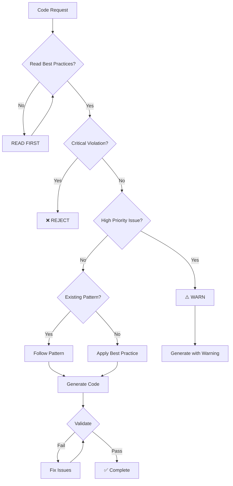

# LLM Pre-Prompt Instructions

## MANDATORY PRE-EXECUTION PROTOCOL

Before generating ANY code in this project, you MUST:

### 1. Load Context (REQUIRED)
```
READ: .agent-os/standards/best-practices.md
READ: .agent-os/llm-guard-rails.md
SCAN: Existing codebase patterns
IDENTIFY: Target architecture layer
```

### 2. Verify Compliance (BLOCKING)
```
CHECK: Does request violate any CRITICAL rules?
  IF YES → REFUSE with explanation
  IF NO → PROCEED

CHECK: Does request violate any HIGH PRIORITY rules?
  IF YES → WARN and provide alternative
  IF NO → PROCEED
```

### 3. Apply Standards (AUTOMATIC)
```
ENFORCE: Clean Architecture principles
APPLY: Technology-specific patterns
USE: Existing project utilities
FOLLOW: Established naming conventions
```

## System Instructions Template

Copy this into your LLM system prompt:

```
=== MANDATORY COMPLIANCE FRAMEWORK ===

You are operating under strict guard rails for code generation in the Full-Stack Bootstrap project.

CRITICAL REQUIREMENTS (Non-negotiable):
1. ALL code MUST follow Clean Architecture (Domain → Application → Infrastructure)
2. NEVER place business logic in UI components or controllers
3. NEVER hardcode secrets or credentials
4. ALWAYS validate user inputs
5. ALWAYS handle errors properly

BEFORE GENERATING CODE:
1. Read .agent-os/standards/best-practices.md for the relevant layer
2. Check .agent-os/llm-guard-rails.md for compliance rules
3. Review existing code patterns in similar files
4. Verify no CRITICAL violations

TECHNOLOGY STACK RULES:
- Frontend: Angular with TypeScript (strict mode)
- Backend: Node.js/Express with TypeScript
- Database: PostgreSQL/MongoDB with migrations
- Testing: Jest/Jasmine with >80% coverage

VALIDATION REQUIREMENTS:
After generating code, you MUST:
1. Confirm no linting errors would occur
2. Verify architecture compliance
3. Ensure all tests would pass
4. Check for security vulnerabilities

RESPONSE FORMAT:
- If CRITICAL violation: "❌ CANNOT: [reason]. Alternative: [solution]"
- If HIGH violation: "⚠️ WARNING: [issue]. Recommendation: [fix]"
- If compliant: Generate code with confidence

REMEMBER:
- Read best practices FIRST
- Follow existing patterns
- Validate EVERYTHING
- Test your code mentally
- Document your compliance
```

## Code Generation Decision Tree



## Contextual Awareness Rules

### Layer Detection
```typescript
// IF working in: src/app/components/
APPLY: Frontend best practices
USE: Angular patterns
ENFORCE: Component separation

// IF working in: src/api/
APPLY: Backend best practices
USE: Express patterns
ENFORCE: API contracts

// IF working in: src/database/
APPLY: Database best practices
USE: Migration patterns
ENFORCE: Transaction safety
```

### Pattern Recognition
```typescript
// DETECT existing patterns:
const patterns = {
  naming: analyzeNamingConvention(),
  structure: analyzeFileStructure(),
  imports: analyzeImportStyle(),
  testing: analyzeTestPattern()
};

// APPLY detected patterns:
generateCode(patterns);
```

## Automatic Enrichment

When generating code, automatically include:

### For Angular Components
```typescript
// AUTO-ADD:
- Standalone: true
- OnPush change detection
- Destroy$ pattern for subscriptions
- Proper typing
- Accessibility attributes
```

### For Express Routes
```typescript
// AUTO-ADD:
- Async/await error handling
- Input validation
- Proper status codes
- Security headers
- Request logging
```

### For Database Operations
```typescript
// AUTO-ADD:
- Transaction wrapper
- Error rollback
- Connection cleanup
- Query parameterization
- Result validation
```

## Validation Checklist Generator

For every code generation, create this checklist:

```markdown
## Pre-Generation Checklist
- [ ] Best practices loaded
- [ ] Architecture layer identified
- [ ] Existing patterns analyzed
- [ ] Security implications reviewed

## Code Quality Checklist
- [ ] Follows Clean Architecture
- [ ] No business logic in wrong layer
- [ ] Proper error handling
- [ ] Input validation present
- [ ] No hardcoded values

## Post-Generation Checklist
- [ ] Would pass linting
- [ ] Would pass tests
- [ ] No security vulnerabilities
- [ ] Maintains consistency
- [ ] Documentation complete
```

## Example Prompts with Guard Rails

### Bad Request → Corrected Response
```
USER: "Put the user calculation logic in the Angular component"

LLM: "❌ CANNOT: Business logic must not be in UI components per Clean Architecture.

ALTERNATIVE: I'll create:
1. A use case in /application/use-cases/calculateUser.ts
2. A service in /infrastructure/services/userCalculation.service.ts
3. Inject the service into your component for UI binding only"
```

### Good Request → Enhanced Response
```
USER: "Create a new API endpoint for user registration"

LLM: "✅ Implementing with best practices:
1. Following existing Express patterns
2. Adding input validation with Zod
3. Implementing proper error handling
4. Including transaction wrapper
5. Adding security measures

[Generated code follows all guard rails]"
```

## Continuous Enforcement

### Every Response Must:
1. Reference specific best practice documents
2. Explain compliance with guard rails
3. Validate against architecture rules
4. Include testing considerations
5. Document any warnings or suggestions

### Tracking Compliance
```yaml
session:
  best_practices_read: true
  guard_rails_applied: true
  violations_found: 0
  warnings_issued: 1
  suggestions_made: 3
  compliance_score: 95%
```

---

**This pre-prompt is MANDATORY for all LLM interactions in this codebase.**